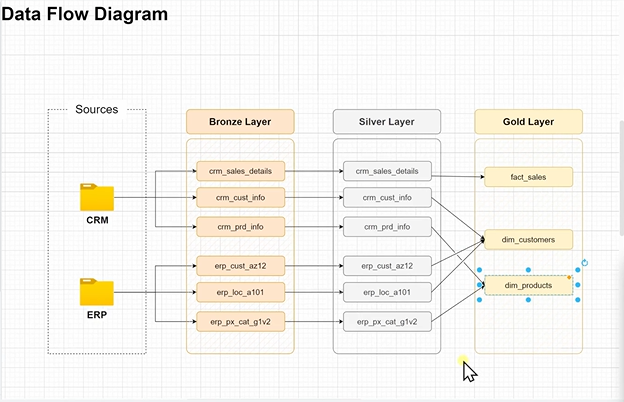
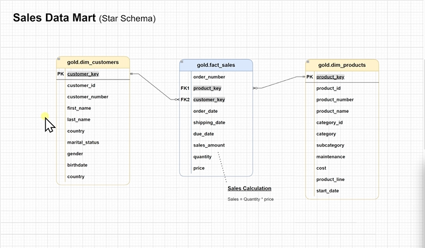
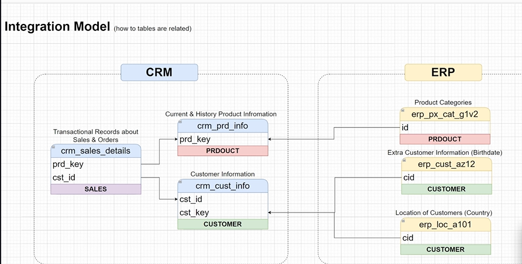

# 🏭 Data Warehouse Construction: End-to-End ETL Project


## 📖 Project Overview

This project demonstrates the creation of a modern Data Warehouse solution using **Microsoft SQL Server**. It implements a full **ETL (Extract, Transform, Load)** pipeline that ingests raw data from disparate sources (CRM and ERP), cleanses and standardizes it, and structures it into a high-performance **Star Schema** for Business Intelligence (BI) and reporting.

The architecture follows the **Medallion Architecture** (Bronze, Silver, Gold layers) to ensure data quality and lineage.

---

## 🏗️ Architecture & Design

### High-Level Architecture
The solution moves data through three distinct layers, transforming it from raw CSV files into business-ready dimensions and facts.


*[Figure 1: High-Level Architecture Overview]*

### Data Flow Diagram
The visual representation below illustrates the data lineage from source systems to the final consumption layer.



*[Figure 2: ETL Data Flow]*

---

## 🛠️ Tech Stack

* **Database:** Microsoft SQL Server
* **ETL Orchestration:** T-SQL Stored Procedures
* **Data Modeling:** Star Schema (Kimball Methodology)
* **Source Format:** CSV Flat Files
* **Concepts Applied:**
    * Slowly Changing Dimensions (SCD Type 2)
    * Data Quality Checks & Validation
    * Bulk Inserts & Performance Optimization
    * Error Handling & Transaction Logging

---

## 📂 The Medallion Architecture

### 1. 🥉 Bronze Layer (Raw Ingestion)
* **Objective:** Ingest data "as-is" from source CSV files.
* **Mechanism:** Uses `BULK INSERT` with `TRUNCATE` pattern (Full Load).
* **Sources:**
    * **CRM:** Customer Info, Product Info, Sales Details.
    * **ERP:** Legacy Customer Data (AZ12), Location Data (A101), Product Categories (G1V2).
* **Characteristics:** No transformations, loose data types, high-speed ingestion.

### 2. 🥈 Silver Layer (Cleansed & Standardized)
* **Objective:** Clean, normalize, and validate data.
* **Key Transformations:**
    * **Data Integrity:** Deduplication of customer records using `ROW_NUMBER()`.
    * **Standardization:** Mapping codes (e.g., 'M' -> 'Male', 'DE' -> 'Germany').
    * **Logic:** Handling `NULL` values, trimming whitespace, and validating dates.
    * **Calculations:** Deriving `prd_end_date` using `LEAD()` for historical tracking.

### 3. 🥇 Gold Layer (Business Ready)
* **Objective:** Optimize data for reporting and analytics.
* **Model:** Star Schema.
* **Components:**
    * **Fact Table:** `fact_sales` (Transactional center).
    * **Dimensions:** `dim_customers`, `dim_products`.
* **Logic:** Surrogate Keys, Referential Integrity checks, and final business logic application.



*[Figure 3: The Final Star Schema Model]*

---

## 🔗 Integration Model

The project integrates two distinct source systems. The diagram below shows how raw entities from CRM and ERP are mapped and related before entering the Data Warehouse.



*[Figure 4: Source System Integration]*

---

## 🔍 Data Quality & Validation

A robust quality assurance process is implemented using a dedicated SQL script (`quality_checks_gold.sql`). It validates:
1.  **Referential Integrity:** Ensures no orphan records in Fact tables.
2.  **Uniqueness:** Validates Surrogate Keys in Dimensions.
3.  **Completeness:** Flags missing critical attributes (e.g., Country, Gender).
4.  **Consistency:** Checks for negative values in financial metrics (Cost, Sales).

---

## 🚀 How to Run the Project

1.  **Prerequisites:**
    * Install Microsoft SQL Server and SSMS.
    * Download the `datasets` folder containing the source CSVs.

2.  **Database Setup:**
    ```sql
    -- Run the initialization script
    CREATE DATABASE DataWarehouse;
    ```

3.  **Execute Pipelines:**
    Run the Stored Procedures in the following order:
    ```sql
    -- 1. Load Raw Data
    EXEC bronze_layer.load_bronze;

    -- 2. Clean & Transform
    EXEC silver_layer.load_silver;
    
    -- 3. Generate Gold Views (No exec needed, just query views)
    SELECT * FROM gold_layer.fact_sales;
    ```

4.  **Verify Data Quality:**
    Execute the validation script to generate a health report of the Data Warehouse.

---

## 📁 Repository Structure

```text
├── datasets/               # Raw CSV source files (CRM & ERP)
├── docs/                   # Documentation images
├── scripts/
│   ├── 01_ddl/             # Table definitions (Bronze, Silver)
│   ├── 02_bronze/          # Stored Procedures for Bronze Layer
│   ├── 03_silver/          # Stored Procedures for Silver Layer
│   ├── 04_gold/            # View definitions for Gold Layer
│   └── 05_quality_checks/  # Data Validation scripts
├── README.md               # Project documentation
└── LICENSE                 # License file
##Author: Vasilescu Alexandru Gabriel

License: MIT
